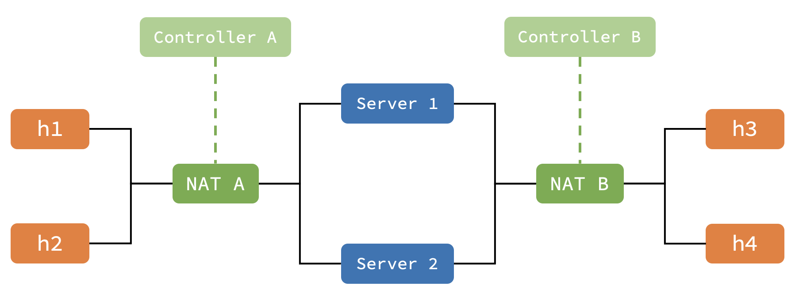
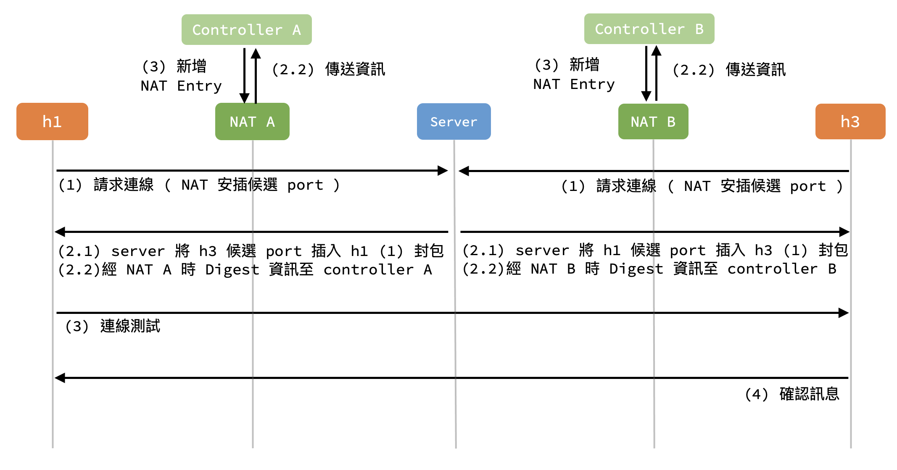
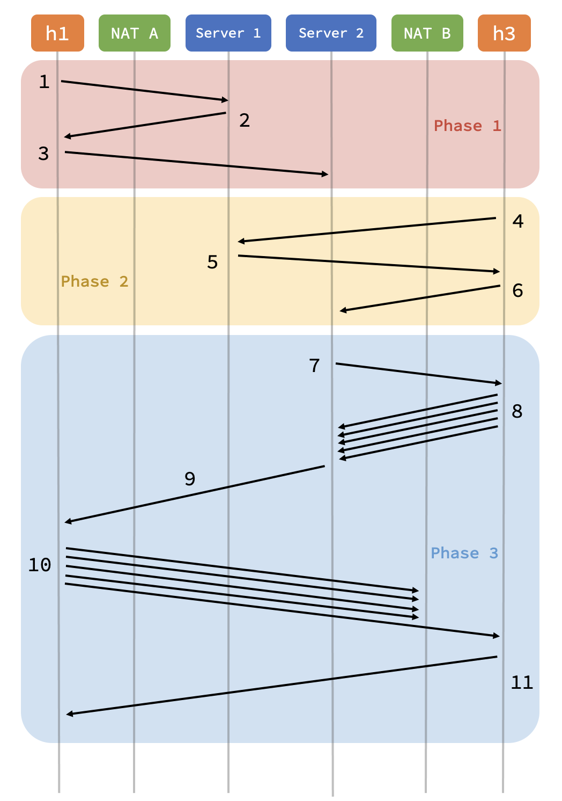

# Improvement of Symmetric NAT Traversal Mechanism in p4 Based SDN

## To Know
You don't have download all the files. Only the `p4-nat-concise` is needed.

## Credit
This repository is forked from [blizzardplus's p4-nat repository](https://github.com/blizzardplus/p4-nat)

I found out that there are a lot of deprecated functions and features, so I rewrite basically all the framework for Project

## Introduction
This is a Project proposing an solution for `Symmetric NAT Traversal` using p4 based SDN.

I compared my solution with which proposed by Waseda University in this [paper](https://www.semanticscholar.org/paper/A-New-Method-for-Symmetric-NAT-Traversal-in-UDP-and-Yamada-Yoshida/0004757d7fc7683706b0decd8ec6ee6bdf638cc2?p2df)

# Getting started

## Build Up The Environment
- Ubuntu 16.04 LTS
    > Follow Official P4-Tutorial Environment [setup](https://github.com/p4lang/tutorials) 
- Python 2.7.12

## Compilation 
1. Compile p4 porgram:
    ```bash
    $ cd ~/Desktop/p4-nat/build
    $ p4c --target bmv2 --arch v1model --std p4-16 ../simple_router_16.p4
    $ p4c --target bmv2 --arch v1model --std p4-16 ../simple_router_16.p4 --p4runtime-files ./simple_router_16.p4.p4info.txt
    ```
2. Start the BMv2 CLI:
    ```bash 
    $ cd ~/Desktop/p4-nat/utils
    $ sudo ./build_P2P_Topo.py -j ../build/simple_router_16.json
    ```

## Controller 
1. Open a new terminal and change to `controller` folder.
    ```bash 
    $ cd ~/Desktop/p4-nat/controller
    ```
2. Launch controller with configuration:
    - usage: `sudo python ./p4runtime_controller.py --method <method> --port--algo <port-algo>`
        - `<method>` : 
            1. `method1` : my method
            2. `method2` : method proposed by paper
        - `<port-algo>` : port assigning algorithm
            1. `inc` : increment
            2. `dec` : decrement
            3. `random` : random
    - (e.g.)
        ```bash
        $ sudo python ./p4runtime_controller.py --method method1 --port-algo random
        ``` 

# Methods
When successfully build up the environment and controller, try to launch the corresponding CLI and test out the program.

## Topology
Topology of my experiment environment.


## Method 1: My Solution

### Algorithm
The workflow of my algorithm.


### Launch program
1. In CLI:
    - Open terminal of `h1`, `h3`, and `server1` 
        ```bash 
        $ xterm h1 h3 server1
        ``` 
2. For Host:
    - Host : `h1`, `h2`, `h3`, `h4`
    - Usage: `./host_method1.py <through server> <whoAmI> <whom2connect> <Port on host>`
    - (e.g.) 
        ```
            h1 -----> server1 -----> h3
        ```
        ```bash
        # On h1
        $ cd ../test
        $ ./host_method1.py server1 h1 h3 33333 

        # On h3
        $ cd ../test
        $ ./host_method1.py server1 h3 h1 33333 
        ```
3. For Server:
    - Server : `server1`, `server2`
    - Usage: `./server_method1.py <server>`
    - (e.g.) 
        ```
            h1 -----> server1 -----> h3
        ```
        ```bash
        # On server1
        $ cd ../test
        $ ./server_method1.py server1
        ```

## Method 2: Method in Paper

### Algorithm
The workflow of the algorithm was proposed by Waseda University in the [paper](https://www.semanticscholar.org/paper/A-New-Method-for-Symmetric-NAT-Traversal-in-UDP-and-Yamada-Yoshida/0004757d7fc7683706b0decd8ec6ee6bdf638cc2?p2df).


### Launch Program
1. In CLI:
    - Open terminal of two `h1`, two `h3`, `server1`, and 'server2'
        ```bash 
        $ xterm h1 h1 h3 h3 server1 server2
        ``` 
2. For Host:
    - Host : `h1`, `h2`, `h3`, `h4`
    - Usage: `./host_method1.py <whoAmI> <whom2connect> <timeOfExe>`
    - `<timeOfExe>`: 
        - `Purpose`: This parameter is for testing performance. When testing, you may have to execute the program multiple times. The internal counter `WILL NOT` refresh every time you re-execute. Therefore, I added this parameter for informing the program to add the counter with 1000 in order to make sure that the outcome is correct. 
        - `Usage`: 
            - `1`: means the first time you execute the program
            - `other number`: 
    - (e.g.) 
        ```
            h1 -----> server1 -----> h3
            |                        ^
            |                        |
            --------> server2 --------
        ```
        ```bash
        # On h1
        $ cd ../test
        $ ./host_method2.py h1 h3 1

        # On h3
        $ cd ../test
        $ ./host_method2.py h3 h1 1
        ```
3. For Server:
    - Server : `server1`, `server2`
    - Usage: `./<server>_method1.py `
    - (e.g.) 
        ```
            h1 -----> server1 -----> h3
            |                        ^
            |                        |
            --------> server2 --------
        ```
        ```bash
        # On server1
        $ cd ../test
        $ ./server1_method2.py

        # On server2
        $ cd ../test
        $ ./server2_method2.py
        ```
